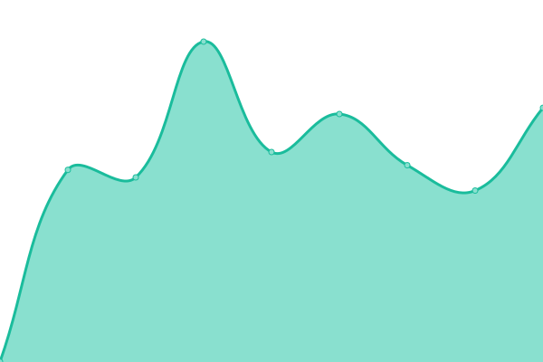

# [📈 Live Status](https://demo.upptime.js.org): <!--live status--> **🟩 All systems operational**

This repository contains the open-source uptime monitor and status page for [braunma](https://demo.upptime.js.org), powered by [Upptime](https://github.com/upptime/upptime).

**[LINK to portal: https://braunma.github.io/dataloft-endpoint-monitor/](https://braunma.github.io/dataloft-endpoint-monitor/)**

With [Upptime](https://upptime.js.org), you can get your own unlimited and free uptime monitor and status page, powered entirely by a GitHub repository. We use [Issues](https://github.com/braunma/dataloft-endpoint-monitor/issues) as incident reports, [Actions](https://github.com/braunma/dataloft-endpoint-monitor/actions) as uptime monitors, and [Pages](https://braunma.github.io/dataloft-endpoint-monitor) for the status page.

With [Upptime](https://upptime.js.org), you can get your own unlimited and free uptime monitor and status page, powered entirely by a GitHub repository. We use [Issues](https://github.com/braunma/dataloft-endpoint-monitor/issues) as incident reports, [Actions](https://github.com/braunma/dataloft-endpoint-monitor/actions) as uptime monitors, and [Pages](https://demo.upptime.js.org) for the status page.

# 

This repository contains the open-source uptime monitor and status page for [braunma](https://braunma.github.io/dataloft-endpoint-monitor), powered by [Upptime](https://github.com/upptime/upptime).

With [Upptime](https://upptime.js.org), you can get your own unlimited and free uptime monitor and status page, powered entirely by a GitHub repository. We use [Issues](https://github.com/braunma/dataloft-endpoint-monitor/issues) as incident reports, [Actions](https://github.com/braunma/dataloft-endpoint-monitor/actions) as uptime monitors, and [Pages](https://braunma.github.io/dataloft-endpoint-monitor) for the status page.

<!--start: status pages-->
<!-- This summary is generated by Upptime (https://github.com/upptime/upptime) -->
<!-- Do not edit this manually, your changes will be overwritten -->
<!-- prettier-ignore -->
| URL | Status | History | Response Time | Uptime |
| --- | ------ | ------- | ------------- | ------ |
|  [Dev Charite edc](https://dev-ids.health-x.charite.de/health/1) | 🟩 Up | [dev-charite-edc.yml](https://github.com/braunma/dataloft-endpoint-monitor/commits/HEAD/history/dev-charite-edc.yml) | 

 759ms
     
 | 

<a href="https://braunma.github.io/dataloft-endpoint-monitor/history/dev-charite-edc">99.43%</a>
    

|  [Dev Charite idat matcher](https://dev-ids.health-x.charite.de/health/2) | 🟩 Up | [dev-charite-idat-matcher.yml](https://github.com/braunma/dataloft-endpoint-monitor/commits/HEAD/history/dev-charite-idat-matcher.yml) | 

 147ms
     
 | 

<a href="https://braunma.github.io/dataloft-endpoint-monitor/history/dev-charite-idat-matcher">99.43%</a>
    

|  [Dev Charite gateway](https://dev-ids.health-x.charite.de/health/3) | 🟩 Up | [dev-charite-gateway.yml](https://github.com/braunma/dataloft-endpoint-monitor/commits/HEAD/history/dev-charite-gateway.yml) | 

 146ms
     
 | 

<a href="https://braunma.github.io/dataloft-endpoint-monitor/history/dev-charite-gateway">99.44%</a>
    

|  [Dev Charite gateway-iop-connection](https://dev-ids.health-x.charite.de/health/4) | 🟩 Up | [dev-charite-gateway-iop-connection.yml](https://github.com/braunma/dataloft-endpoint-monitor/commits/HEAD/history/dev-charite-gateway-iop-connection.yml) | 

 135ms
     
 | 

<a href="https://braunma.github.io/dataloft-endpoint-monitor/history/dev-charite-gateway-iop-connection">99.44%</a>
    

|  [Charite edc](https://ids.health-x.charite.de/health/1) | 🟩 Up | [charite-edc.yml](https://github.com/braunma/dataloft-endpoint-monitor/commits/HEAD/history/charite-edc.yml) | 

 1731ms
     
 | 

<a href="https://braunma.github.io/dataloft-endpoint-monitor/history/charite-edc">99.59%</a>
    

|  [Charite idat matcher](https://ids.health-x.charite.de/health/2) | 🟩 Up | [charite-idat-matcher.yml](https://github.com/braunma/dataloft-endpoint-monitor/commits/HEAD/history/charite-idat-matcher.yml) | 

 140ms
     
 | 

<a href="https://braunma.github.io/dataloft-endpoint-monitor/history/charite-idat-matcher">99.60%</a>
    

|  [Charite gateway](https://ids.health-x.charite.de/health/3) | 🟩 Up | [charite-gateway.yml](https://github.com/braunma/dataloft-endpoint-monitor/commits/HEAD/history/charite-gateway.yml) | 

 139ms
     
 | 

<a href="https://braunma.github.io/dataloft-endpoint-monitor/history/charite-gateway">99.60%</a>
    

|  [Charite gateway-iop-connection](https://ids.health-x.charite.de/health/4) | 🟩 Up | [charite-gateway-iop-connection.yml](https://github.com/braunma/dataloft-endpoint-monitor/commits/HEAD/history/charite-gateway-iop-connection.yml) | 

 127ms
     
 | 

<a href="https://braunma.github.io/dataloft-endpoint-monitor/history/charite-gateway-iop-connection">99.46%</a>
    

|  [Personal EDC Gateway](https://gateway.dataloft-ionos.de/docs) | 🟩 Up | [personal-edc-gateway.yml](https://github.com/braunma/dataloft-endpoint-monitor/commits/HEAD/history/personal-edc-gateway.yml) | 

 616ms
     
 | 

<a href="https://braunma.github.io/dataloft-endpoint-monitor/history/personal-edc-gateway">99.84%</a>
    

|  [Personal EDC Gateway - development](https://gateway.dev-dataloft-ionos.de/docs) | 🟩 Up | [personal-edc-gateway-development.yml](https://github.com/braunma/dataloft-endpoint-monitor/commits/HEAD/history/personal-edc-gateway-development.yml) | 

 623ms
     
 | 

<a href="https://braunma.github.io/dataloft-endpoint-monitor/history/personal-edc-gateway-development">100.00%</a>
    

|  [Dataloft-Catalogue](https://gxfs-catalogue.dataloft-ionos.de/participants) | 🟩 Up | [dataloft-catalogue.yml](https://github.com/braunma/dataloft-endpoint-monitor/commits/HEAD/history/dataloft-catalogue.yml) | 

 539ms
     
 | 

<a href="https://braunma.github.io/dataloft-endpoint-monitor/history/dataloft-catalogue">100.00%</a>
    

<!--end: status pages-->

[**Visit our status website →**](https://demo.upptime.js.org)

## 📄 License

- Powered by: [Upptime](https://github.com/upptime/upptime)
- Code: [MIT](./LICENSE) © [braunma](https://demo.upptime.js.org)
- Data in the `./history` directory: [Open Database License](https://opendatacommons.org/licenses/odbl/1-0/)
  |  [Google](https://www.google.com) | 🟩 Up | [google.yml](https://github.com/upptime/upptime/commits/HEAD/history/google.yml) | 

 93ms
     
 | 

<a href="https://demo.upptime.js.org/history/google">100.00%</a>
    

  |  [Wikipedia](https://en.wikipedia.org) | 🟩 Up | [wikipedia.yml](https://github.com/upptime/upptime/commits/HEAD/history/wikipedia.yml) | 

 183ms
     
 | 

<a href="https://demo.upptime.js.org/history/wikipedia">100.00%</a>
    

  |  [Hacker News](https://news.ycombinator.com) | 🟩 Up | [hacker-news.yml](https://github.com/upptime/upptime/commits/HEAD/history/hacker-news.yml) | 

 326ms
     
 | 

<a href="https://demo.upptime.js.org/history/hacker-news">100.00%</a>
    

  |  [Test Broken Site](https://thissitedoesnotexist.koj.co) | 🟥 Down | [test-broken-site.yml](https://github.com/upptime/upptime/commits/HEAD/history/test-broken-site.yml) | 

 0ms
     
 | 

<a href="https://demo.upptime.js.org/history/test-broken-site">0.00%</a>
    

